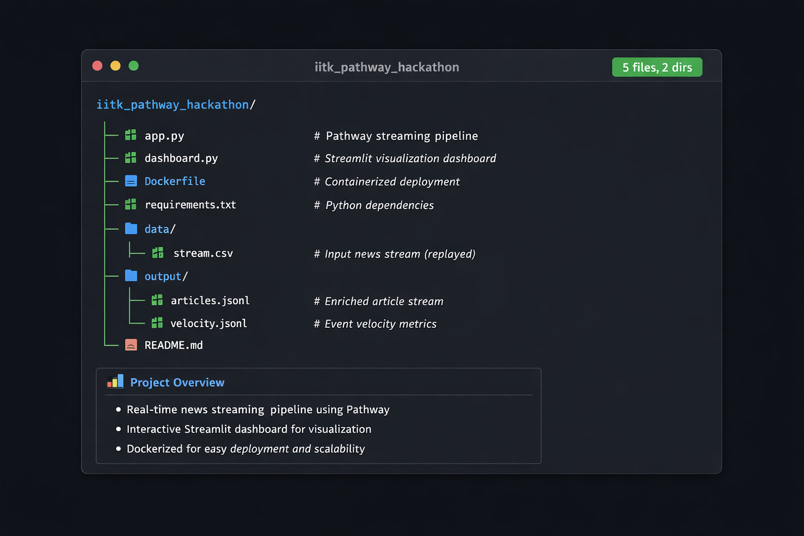

# IITK Pathway Hackathon – Real-Time Misinformation Detection System

## 1. Project Overview

This project was developed as part of the **IIT Kanpur Pathway Hackathon**. It implements a **real-time news monitoring and misinformation risk detection system** using **Pathway** for streaming data processing and **Streamlit** for visualization.

The system continuously ingests news articles, clusters them into evolving events using semantic similarity, tracks their velocity over time, and analyzes each event for emotional tone and misinformation risk using modern NLP models.

### Key Objectives

* Detect trending news events in real time
* Cluster semantically similar articles into evolving events
* Measure how fast an event is spreading (article velocity)
* Assess misinformation / fake news risk
* Provide an interactive dashboard for monitoring and analysis

---

## 2. High-Level Architecture


**Core Components:**

* **Pathway** – Streaming ingestion, windowing, aggregation
* **Sentence-BERT** – Semantic text embeddings
* **Zero-Shot NLP Models** – Emotion & misinformation analysis
* **Streamlit** – Interactive visualization layer

---

## 3. Repository Structure



---

## 4. Data Flow & Workflow

### Step-by-Step Workflow

#### 1. News Ingestion

* News articles are read from `data/stream.csv`
* `pw.demo.replay_csv` replays the dataset as a simulated live stream

#### 2. Text Embedding

* Article text is converted into dense vectors using:

```
SentenceTransformer("all-MiniLM-L6-v2")
```

* Optimized for fast, real-time semantic similarity

#### 3. Event Detection (Clustering)

* Articles are assigned an `event_id` based on cosine similarity
* If similarity ≥ **0.78**, article joins an existing event
* Otherwise, a new event is dynamically created

#### 4. Temporal Aggregation

* Articles are grouped using **30-minute tumbling windows**
* Velocity = number of articles per event per window

#### 5. Output Generation

* **Enriched articles** → `output/articles.jsonl`
* **Event velocity metrics** → `output/velocity.jsonl`

#### 6. Dashboard Consumption

* Streamlit dashboard reads JSONL outputs
* Performs emotion detection and misinformation scoring
* Displays interactive visualizations

---

## 5. app.py – Streaming & Event Detection Engine

### Core Responsibilities

* Real-time ingestion of news articles
* Semantic clustering into events
* Event velocity computation

### Key Components

#### 5.1 Embedding Model

* `all-MiniLM-L6-v2` Sentence-BERT
* Lightweight and efficient
* Well-suited for streaming pipelines

#### 5.2 Stateful Event Assignment

* Maintains in-memory event centroids
* Uses cosine similarity for assignment
* Dynamically creates new events

**Design Rationale:**

A centroid-based approach is significantly faster than full clustering, making it ideal for real-time streaming scenarios.

#### 5.3 Velocity Calculation

* Uses Pathway `windowby`
* 30-minute tumbling windows
* Measures how quickly an event is gaining traction

---

## 6. dashboard.py – Visualization & Risk Analysis

### Dashboard Features

#### 6.1 Trending Events

* Ranked list by article velocity
* Expandable event details

#### 6.2 Emotion Analysis

Zero-shot emotion classification with the following labels:

* Fear 😱
* Anger 😡
* Sadness 😭
* Joy 😄
* Trust 🤝

#### 6.3 Misinformation Risk Scoring

* Uses **BART-large-MNLI** zero-shot classifier
* Weighted misinformation-related labels
* Produces a **0–100 risk score**

##### Risk Categories

| Score Range | Risk Level     |
| ----------- | -------------- |
| 0–10        | Very Low Risk  |
| 11–30       | Low Risk       |
| 31–50       | Medium Risk    |
| 51–70       | High Risk      |
| 71–100      | Very High Risk |

#### 6.4 Analytics View

* News volume over time
* Top 5 trending events
* Per-event temporal breakdown

---

## 7. Design Decisions & Rationale

### Why Pathway?

* Native support for streaming data
* Built-in windowing & time-based aggregation
* Ideal for real-time hackathon systems

### Why Zero-Shot Classification?

* No labeled dataset required
* Flexible and extensible
* Rapid experimentation

### Why JSONL Outputs?

* Stream-friendly format
* Easy incremental reads
* Works seamlessly with pandas & Streamlit

---

## 8. Deployment & Setup

### Local Setup

#### Step 1: Clone the Repository

```bash
git clone https://github.com/Devil-Gaming-Studios/misinformation-dashboard.git
cd misinformation-dashboard
```

#### Step 2: Build Docker Image

```bash
docker build --no-cache -t dataquest-pathway .
```

#### Step 3: Run Pathway Pipeline

```bash
docker run -it --rm -v ${PWD}:/app dataquest-pathway python /app/app.py
```

⚠️ Keep this terminal running so the dashboard receives live data.

#### Step 4: Launch Dashboard

```bash
pip install -r requirements.txt
streamlit run dashboard.py
```

---

## 9. Limitations

* Event centroids are stored in-memory (non-persistent)
* Zero-shot models are computationally expensive
* CSV replay simulates real-time data but is not a live feed

---

## 10. Future Improvements

* Persistent event storage
* Incremental centroid updates with decay
* GPU acceleration for NLP models
* Integration with live news APIs
* Alerting system for high-risk events

---

**Built for IIT Kanpur Pathway Hackathon 🚀**
