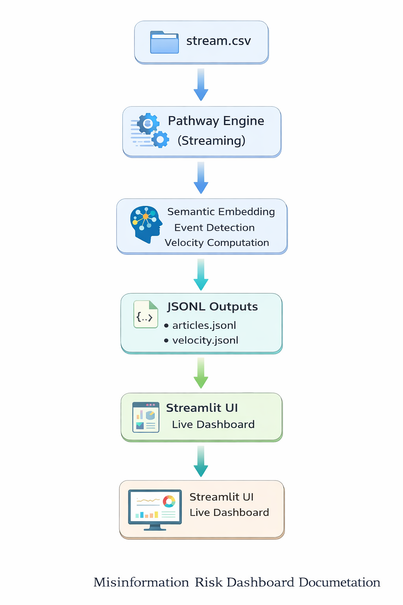

# 📘 Misinformation Risk Dashboard – Technical Documentation

## Overview
The **Misinformation Risk Dashboard** is a real-time system designed to detect, analyze, and visualize potentially misleading or sensational news events.  
It uses **Pathway** as a streaming data engine and modern **NLP models** to perform semantic clustering, event detection, and misinformation risk assessment in near real time.

---

## System Architecture

The system follows a **streaming-first architecture** optimized for incremental computation and low-latency updates.

### High-Level Architecture Diagram

### Component Overview
- **Data Source**: A streaming CSV (`stream.csv`) simulates a continuous news feed.
- **Pathway Engine**: Handles streaming ingestion, stateful processing, and windowed aggregation.
- **Semantic Processing Layer**:
  - Sentence embeddings using SentenceTransformer
  - Event assignment via cosine similarity
  - Velocity computation using tumbling windows
- **Storage Layer**:
  - `articles.jsonl` – enriched article data
  - `velocity.jsonl` – event-wise velocity metrics
- **Visualization Layer**:
  - Streamlit-based dashboard with live updates

---

## Streaming & Incremental Computation

Pathway enables **incremental updates** without recomputing historical data.  
Each incoming article:
1. Is embedded into a semantic vector
2. Is matched against existing event centroids
3. Either joins an existing event or creates a new one
4. Updates velocity metrics inside time windows

This design ensures:
- Low latency
- Bounded memory usage
- Real-time responsiveness

---

## Design Decisions

### Why Pathway?
Pathway provides native support for:
- Streaming data ingestion
- Stateful computation
- Windowed aggregations
- Incremental processing

These capabilities make it well-suited for real-time misinformation detection.

### Why SentenceTransformer + Cosine Similarity?
- Lightweight and fast embeddings
- Efficient semantic grouping
- Minimal computational overhead

### Why Tumbling Windows?
- Clean temporal segmentation
- Prevents unbounded state growth
- Ideal for velocity-based trend detection

### Why Zero-Shot Classification?
- No labeled dataset required
- Easily extensible to new misinformation categories
- Flexible and domain-agnostic

---

## Workflow

1. Articles enter the system via streaming CSV replay
2. Text embeddings are computed for each article
3. Articles are clustered into semantic events
4. Event velocity is computed over fixed time windows
5. Outputs are written to JSONL files
6. The dashboard reads outputs and updates automatically

---

## Example Scenario

A breaking-news scenario is simulated where multiple sensational articles related to the same topic (e.g., UFO sightings or viral conspiracy claims) enter the stream.

As the article volume increases:
- The system groups them into a single event
- Velocity spikes are detected
- High misinformation risk is highlighted
- Emotional indicators such as fear and anger become visible

---

## Scalability & Extensibility

- Pathway supports horizontal scaling and distributed execution
- New data sources can be added with minimal changes
- The system can be extended to:
  - Financial news monitoring
  - Social media trend analysis
  - Cybersecurity alert aggregation

---

## Observability

System behavior can be observed through:
- Streaming logs
- JSONL output files
- Live dashboard metrics

Velocity trends and emotion distributions provide transparency into system decisions.

---

## Conclusion

The Misinformation Risk Dashboard demonstrates how streaming data, modern NLP, and real-time visualization can be combined to detect and analyze misinformation effectively.  
The architecture is modular, scalable, and adaptable to multiple real-world domains.
